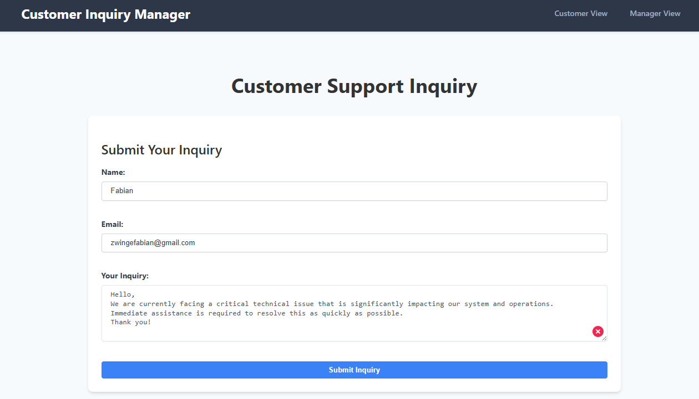
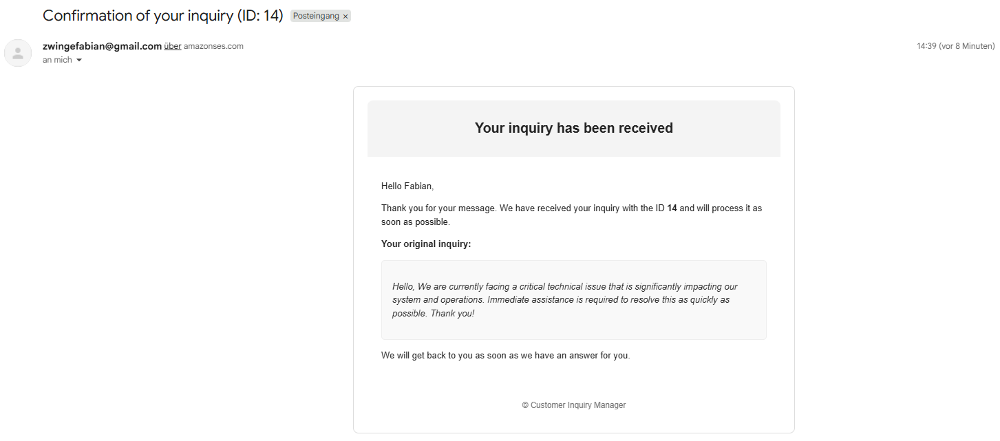
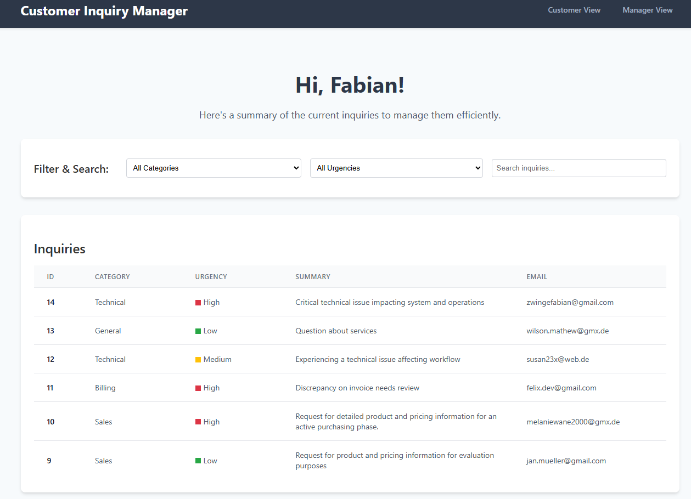
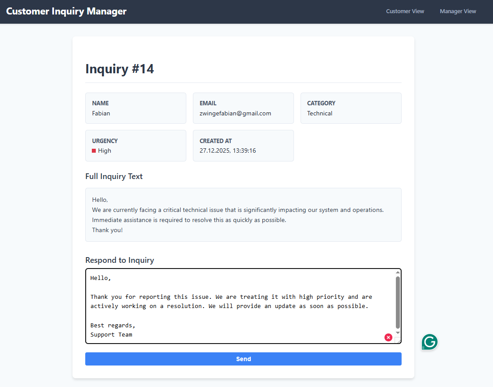
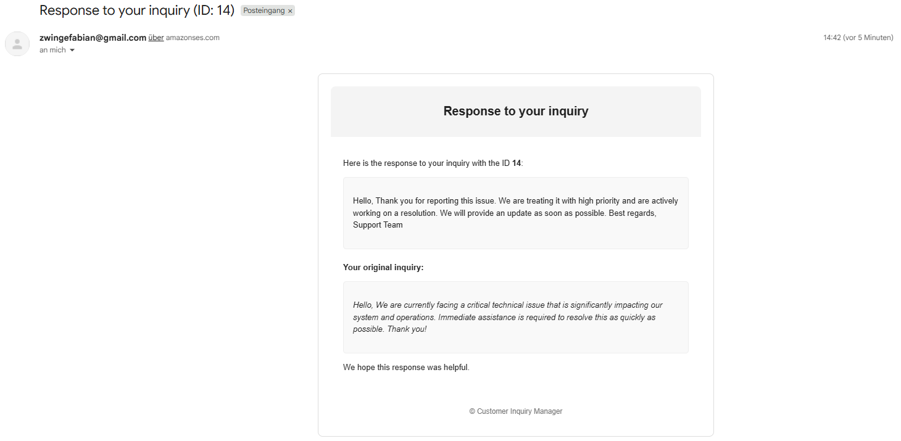

# 🚀 AWS Customer Inquiry Manager

The AWS Customer Inquiry Manager is a web-based application for submitting, managing, and responding to customer inquiries.  
It combines a ReactJS frontend with a FastAPI backend deployed on AWS EC2 and leverages AWS Bedrock for AI-powered inquiry classification.  
Customer inquiries are stored in a PostgreSQL database on AWS RDS and handled through a dedicated manager dashboard, with all communication automated via AWS SES.

---

## 📸 How the app looks...

Below is a step-by-step walkthrough of the application flow, from submitting a customer inquiry to receiving a response.

### 1. Customer Inquiry Submission

Customers submit inquiries using a simple form by providing their name, email address, and inquiry text.

---

### 2. Inquiry Confirmation Email

After submission, the system automatically sends a confirmation email to the customer, including the inquiry ID and a copy of the submitted message.

---

### 3. Manager Dashboard

Managers can view all incoming inquiries in a centralized dashboard.  
Inquiries are organized by **category**, **urgency**, **summary**, and **email**, and can be filtered and searched for efficient handling.

---

### 4. Manager View – Responding to an Inquiry

Each inquiry can be opened individually to review its full details and submit a response directly through the manager interface.

---

### 5. Inquiry Response Email

Once a response is sent, the customer automatically receives an email containing the manager’s reply along with the original inquiry for context.

--- 

## 🛠️ Prerequisites for Local Development

- Node.js & npm  
- Python 3.8+  
- AWS account with access to EC2, RDS, Bedrock, SES, and IAM  
- AWS CLI configured with appropriate credentials  

